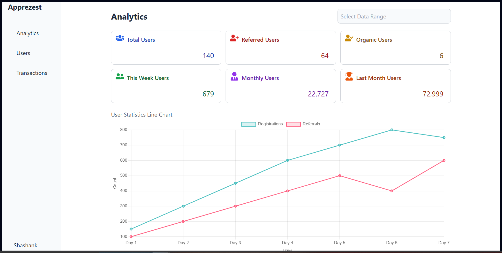

# Frontend Web Application Assignment

## Screenshots


## Introduction
In this assignment, we are tasked with creating a fully functional frontend for a web application using Ripple UI components. We will design three core pages: a login page, a registration page, and a home page. The login and registration pages will have basic input validation, while the home page will showcase dynamic content using cards and graphs. The goal is to create an intuitive, responsive, and visually appealing user interface, ensuring a seamless user experience.

## Project Structure
- `src/`: Contains all the source code.
  - `components/`: Contains the React components for different pages.
    - `Login.jsx`: The login page component.
    - `Register.jsx`: The registration page component.
    - `Home.jsx`: The home page component.
    - `Analytics.jsx`: The analytics.
    - `Transactions.jsx`: The transactions done displayed.
    - `Users.jsx`: The users info displayed.
  - `App.js`: The main application component that defines the routes.

## Pages Overview

### 1. Login Page
- **Features**:
  - Input fields for email and password.
  - Frontend validation for email format and password presence.
  - Utilizes Ripple UI components for form layout and styling.
- **Expected Output**: A responsive and visually consistent login page with basic validation.

### 2. Register Page
- **Features**:
  - Input fields for email, password, and confirm password.
  - Validation to ensure the password fields match.
  - Utilizes Ripple UI for consistent design and responsiveness.
- **Expected Output**: A functional registration page that performs client-side validation on password match.

### 3. Home Page with Navigation Bar and Cards
- **Features**:
  - A navigation bar for accessing different sections of the site.
  - Cards displaying various content (e.g., user statistics or recent activities).
  - Graphs to visualize data using available Ripple UI components.
- **Expected Output**: A fully styled home page featuring a navigation bar, cards, and data graphs using Ripple UI. The layout should be responsive and user-friendly.


## Routing
- **`/`**: This route renders the registration page.
- **`/login`**: This route renders the login page.
- **`/home`**: This route renders the home page, which includes a navigation bar and dynamic content. Clicking on the navigation bar items will redirect you to the corresponding pages.

## Getting Started

### Installation
1. Clone the repository:
   ```bash
   git clone  https://github.com/yshagit31/Assignment_LeadMint
   ```
2. Navigate into the project directory:
   ```bash
     cd <project-directory>
    ````
3. Install dependencies:
   ````bash
   npm install
   ````
4. Run the server\
      ````bash
   npm run dev
   ````
